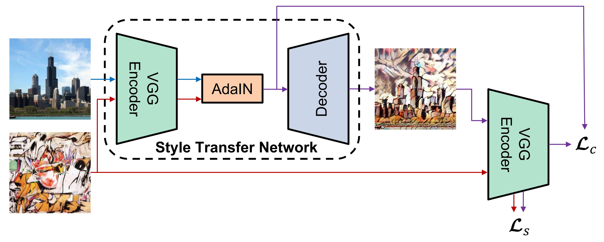
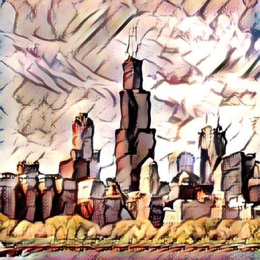

# AdaIN Neural Style Transfer

Implementation of the paper:

> Xun Huang and Serge Belongie. [Arbitrary Style Transfer in Real-time with Adaptive Instance Normalization](https://arxiv.org/abs/1703.06868) (ICCV 2017).



See [here](https://github.com/xunhuang1995/AdaIN-style) for the official Torch implementation.

## Examples
<p align='center'>
  
  
  
<br>
  
  
  
<br>
  
  
  
</p>


## Dependencies
- Python 3.8
- Tensorfow 2.3


## Usage
### Train
1. Download [MSCOCO images](http://mscoco.org/dataset/#download) and [Wikiart images](https://www.kaggle.com/c/painter-by-numbers).
2. Use `--name=<model_name>`, `--content_dir=<coco_path>` and `--style_dir=<wikiart_path>` to provide model name and datasets paths. 
```
python train.py --name=<model_name>  --content_dir=<coco_path> --style_dir=<wikiart_path>
```

### Test
Run `test.py`. It will save every possible combination of content and styles to the output directory.
```
python test.py --name=<model_name> --test_content_img=<content_path> --test_style_img=<style_path>
```

### Hparams setting
Set hyperparameters in `hparams.py` file.

### Tensorboard
Run `tensorboard --logdir ./`

### Content-style trade-off
Use hparam alpha to adjust the degree of stylization
<p align='center'>
  
  
  
  
  
  
<br>
</p>


## Implementation notes
- The decoder generates the output directly [0, 255].

- Conv2d layers with reflect padding.

- Above images are generated after 140,000 steps.

- The model runs using mixed precision.


## Licence
Copyright (c) 2020 Emilio Morales. Free to use, copy and modify for academic research purposes, as long as proper attribution is given and this copyright notice is retained. Contact me for any use that is not academic research. (email: mil.mor.mor at gmail.com).


## Citation
```
@software{morales2020adain,
  author = {Morales, Emilio},
  title = {Adain neural style transfer},
  url = {https://github.com/milmor/adain-neural-style-transfer},
  year = {2020},
}
```